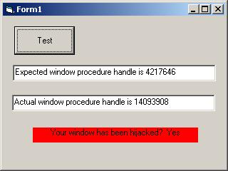



## FYI: Is Your Window HiJacked?

### Description

For the paranoid: A simple test to determine if your window is being subclassed. This is a very simple demonstration &amp; usage/expansion is up to you. Not much use without a form, huh? Oops.
 
### More Info
 

             |
---                |---
**Submitted On**   |2005-07-26 11:30:12
**By**             |[LaVolpe](https://github.com/Planet-Source-Code/PSCIndex/blob/master/ByAuthor/lavolpe.md)
**Level**          |Intermediate
**User Rating**    |4.8 (19 globes from 4 users)
**Compatibility**  |VB 5\.0, VB 6\.0
**Category**       |[Miscellaneous](https://github.com/Planet-Source-Code/PSCIndex/blob/master/ByCategory/miscellaneous__1-1.md)
**World**          |[Visual Basic](https://github.com/Planet-Source-Code/PSCIndex/blob/master/ByWorld/visual-basic.md)
**Archive File**   |[FYI\_\_Is\_Yo1917597262005\.zip](https://github.com/Planet-Source-Code/lavolpe-fyi-is-your-window-hijacked__1-61911/archive/master.zip)

